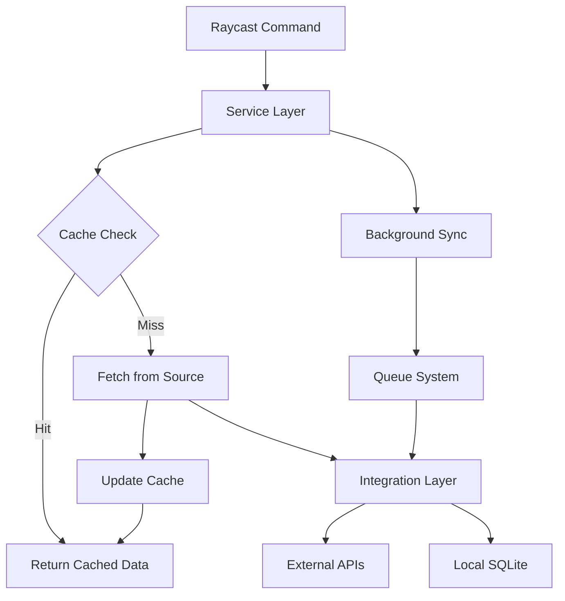

# Pulse Technical Specification

## Executive Summary

Pulse is a Raycast extension designed for instant access to personal life metrics with a focus on sub-100ms load times and AI-assisted development workflows. The architecture prioritizes modularity, type safety, and clear separation of concerns to enable efficient AI pair programming.

## System Architecture

### Core Design Principles

1. **AI-First Development**
   - Self-documenting code with clear interfaces
   - Modular architecture for isolated AI edits
   - Comprehensive type definitions
   - Predictable file structure

2. **Performance Optimization**
   - Lazy loading of data sources
   - In-memory caching with SQLite persistence
   - Background refresh cycles
   - Minimal runtime dependencies

3. **Security & Privacy**
   - Local-first data storage
   - Encrypted credential storage in macOS Keychain
   - No telemetry or external analytics
   - Secure API token management

### Technical Stack

```yaml
Frontend:
  - Framework: Raycast Extension API
  - Language: TypeScript 5.4+
  - UI Components: Raycast UI Kit
  - State Management: React hooks + Context

Backend:
  - Runtime: Node.js 20 LTS
  - Database: SQLite (better-sqlite3)
  - Cache: In-memory with TTL
  - Queue: Bull for background jobs

APIs & Integrations:
  - Notion: Official SDK
  - Banking: Plaid/Finta API
  - Health: Apple HealthKit (via shortcuts)
  - AI: OpenAI for insights

Development:
  - Build: ESBuild (via Raycast)
  - Testing: Vitest + Testing Library
  - Linting: ESLint + Prettier
  - CI/CD: GitHub Actions
```

### Directory Structure

```
pulse/
├── src/
│   ├── commands/          # Raycast command entry points
│   │   ├── dashboard.tsx  # Main dashboard view
│   │   ├── quick-log.tsx  # Quick action commands
│   │   └── settings.tsx   # Configuration UI
│   │
│   ├── components/        # Reusable UI components
│   │   ├── sections/      # Dashboard sections
│   │   ├── charts/        # Data visualizations
│   │   └── common/        # Shared components
│   │
│   ├── services/          # Business logic layer
│   │   ├── data/          # Data fetching/caching
│   │   ├── sync/          # Background sync
│   │   └── ai/            # AI insights
│   │
│   ├── integrations/      # External API clients
│   │   ├── notion/
│   │   ├── banking/
│   │   └── health/
│   │
│   ├── lib/              # Core utilities
│   │   ├── db/           # Database layer
│   │   ├── cache/        # Caching logic
│   │   └── crypto/       # Encryption utils
│   │
│   ├── types/            # TypeScript definitions
│   │   ├── api/          # API response types
│   │   ├── domain/       # Business entities
│   │   └── ui/           # UI component props
│   │
│   └── config/           # Configuration
│       ├── constants.ts
│       └── schema.ts
│
├── scripts/              # Build/dev scripts
├── tests/               # Test suites
└── docs/                # Documentation
```

### Data Flow Architecture



### AI-Optimized Patterns

1. **Single Responsibility Modules**
   ```typescript
   // Each file has one clear purpose
   // services/finance/balance-calculator.ts
   export class BalanceCalculator {
     calculate(accounts: Account[]): Balance { }
   }
   ```

2. **Explicit Interfaces**
   ```typescript
   // types/domain/finance.ts
   export interface FinanceData {
     balance: Balance;
     transactions: Transaction[];
     insights: FinanceInsight[];
   }
   ```

3. **Dependency Injection**
   ```typescript
   // services/dashboard/dashboard-service.ts
   export class DashboardService {
     constructor(
       private finance: FinanceService,
       private health: HealthService,
       private tasks: TaskService
     ) {}
   }
   ```

4. **Clear File Naming**
   ```
   feature-name.type.ts
   balance-calculator.service.ts
   finance-section.component.tsx
   account.interface.ts
   ```

## User Personas & Journeys

### Primary Persona: "Productivity Pro Nathan"

**Demographics:**
- 28-35 year old tech professional
- Uses macOS exclusively
- Tracks finances, health, and productivity
- Values speed and efficiency

**Pain Points:**
- Too many apps to check daily
- Context switching disrupts flow
- Manual data entry is tedious
- Lack of unified view

### User Journey Maps

#### Journey 1: Morning Check-in

```
Trigger: Start of workday
Goal: Quick life metrics review

1. Press F4 → Dashboard appears (<100ms)
2. Scan four quadrants (2-3 seconds)
   - Finance: See overnight market changes
   - Health: Check sleep score
   - Tasks: View today's priorities
   - Habits: See morning routine status
3. Quick action: Log morning water intake
4. Close with ESC → Back to work

Total time: <10 seconds
```

#### Journey 2: Quick Expense Log

```
Trigger: Just paid for lunch
Goal: Log expense without breaking flow

1. Press Cmd+Shift+E → Quick log
2. Type: "lunch 18.50 eating out"
3. Press Enter → Logged
4. See confirmation toast

Total time: <5 seconds
```

#### Journey 3: End-of-Day Review

```
Trigger: Wrapping up work
Goal: Update habits and plan tomorrow

1. Press F4 → Dashboard
2. Click Habits section
3. Check off completed items
4. Click Tasks → Add tomorrow's priority
5. View insights panel for trends

Total time: <30 seconds
```

### Accessibility Considerations

- Full keyboard navigation
- VoiceOver support
- High contrast themes
- Customizable hotkeys
- Clear focus indicators

## Development Experience

### AI Pair Programming Workflow

1. **Context Loading**
   ```bash
   # AI can understand project from:
   pulse/
   ├── README.md           # Project overview
   ├── docs/TECHNICAL_SPEC.md  # This file
   ├── docs/ARCHITECTURE.md    # Detailed patterns
   └── src/types/          # All interfaces
   ```

2. **Task Isolation**
   - Each feature in separate directory
   - Clear boundaries between modules
   - Minimal cross-dependencies
   - Type-safe interfaces

3. **Code Generation Helpers**
   ```typescript
   // scripts/generate-component.ts
   npm run generate component FinanceChart
   // Creates: src/components/charts/finance-chart/
   ```

4. **Testing Strategy**
   ```typescript
   // Every module has parallel test file
   src/services/finance/balance.service.ts
   src/services/finance/balance.service.test.ts
   ```

### Development Commands

```bash
# Start development
npm run dev

# Type checking
npm run type-check

# Run tests
npm run test
npm run test:watch

# Generate types from APIs
npm run generate:types

# Analyze bundle
npm run analyze

# Format code
npm run format
```

### Code Style Guidelines

1. **Naming Conventions**
   - Components: PascalCase
   - Files: kebab-case
   - Interfaces: PascalCase with 'I' prefix
   - Types: PascalCase
   - Constants: UPPER_SNAKE_CASE

2. **File Organization**
   - One component per file
   - Co-locate tests
   - Group by feature
   - Shared code in lib/

3. **TypeScript Standards**
   - Strict mode enabled
   - No implicit any
   - Explicit return types
   - Interface over type alias

## Performance Requirements

### Load Time Targets

| Metric | Target | Max Acceptable |
|--------|--------|----------------|
| Cold start | 50ms | 100ms |
| Hot reload | 20ms | 50ms |
| API response | 200ms | 500ms |
| UI interaction | 16ms | 33ms |

### Optimization Strategies

1. **Code Splitting**
   - Lazy load heavy components
   - Dynamic imports for features
   - Tree shaking unused code

2. **Data Management**
   - Prefetch on app launch
   - Background refresh
   - Optimistic UI updates
   - Stale-while-revalidate

3. **Rendering**
   - Virtualized lists
   - Memoized components
   - Debounced searches
   - Progressive loading

## Security Architecture

### Credential Management

```typescript
// lib/security/keychain.ts
export class KeychainManager {
  async store(service: string, account: string, password: string): Promise<void>
  async retrieve(service: string, account: string): Promise<string>
  async delete(service: string, account: string): Promise<void>
}
```

### API Security

1. **Token Storage**
   - Never in code or config files
   - Always in macOS Keychain
   - Refresh tokens implemented
   - Token expiry handling

2. **Data Encryption**
   - SQLite encryption at rest
   - TLS for all API calls
   - No sensitive data in logs
   - Secure memory handling

## Error Handling & Monitoring

### Error Boundaries

```typescript
// components/error-boundary.tsx
export class DashboardErrorBoundary extends Component {
  static getDerivedStateFromError(error: Error) {
    return { hasError: true, error };
  }
}
```

### Logging Strategy

```typescript
// lib/logger.ts
export const logger = {
  info: (message: string, context?: any) => {},
  warn: (message: string, context?: any) => {},
  error: (error: Error, context?: any) => {},
};
```

### Health Checks

- API connectivity tests
- Database integrity checks
- Cache performance metrics
- Memory usage monitoring

## Testing Strategy

### Test Pyramid

```
         /\
        /  \    E2E Tests (10%)
       /----\   - Critical user journeys
      /      \  Integration Tests (30%)
     /--------\ - API integrations
    /          \- Service interactions
   /------------\Unit Tests (60%)
  /______________\- Business logic
                  - Utilities
```

### Testing Patterns

```typescript
// services/finance/__tests__/balance.service.test.ts
describe('BalanceService', () => {
  it('calculates total balance across accounts', () => {
    const accounts = [
      { balance: 1000 },
      { balance: 2000 }
    ];
    expect(service.calculateTotal(accounts)).toBe(3000);
  });
});
```

## Deployment & Distribution

### Release Process

1. **Version Management**
   - Semantic versioning
   - Automated changelog
   - Git tags for releases

2. **Distribution**
   - Raycast Store submission
   - GitHub releases
   - Auto-update mechanism

3. **Rollback Strategy**
   - Version pinning
   - Graceful degradation
   - Feature flags

## Future Considerations

### Scalability

- Plugin architecture for data sources
- Custom widget system
- Multi-user support (families)
- Cross-platform compatibility

### AI Enhancements

- Natural language commands
- Predictive insights
- Automated categorization
- Smart notifications

### Integration Expansion

- More banking providers
- Fitness trackers
- Calendar systems
- Investment platforms

## Conclusion

This specification provides a comprehensive blueprint for building Pulse with a focus on performance, developer experience, and AI-assisted workflows. The modular architecture and clear patterns enable efficient development while maintaining code quality and user experience standards.